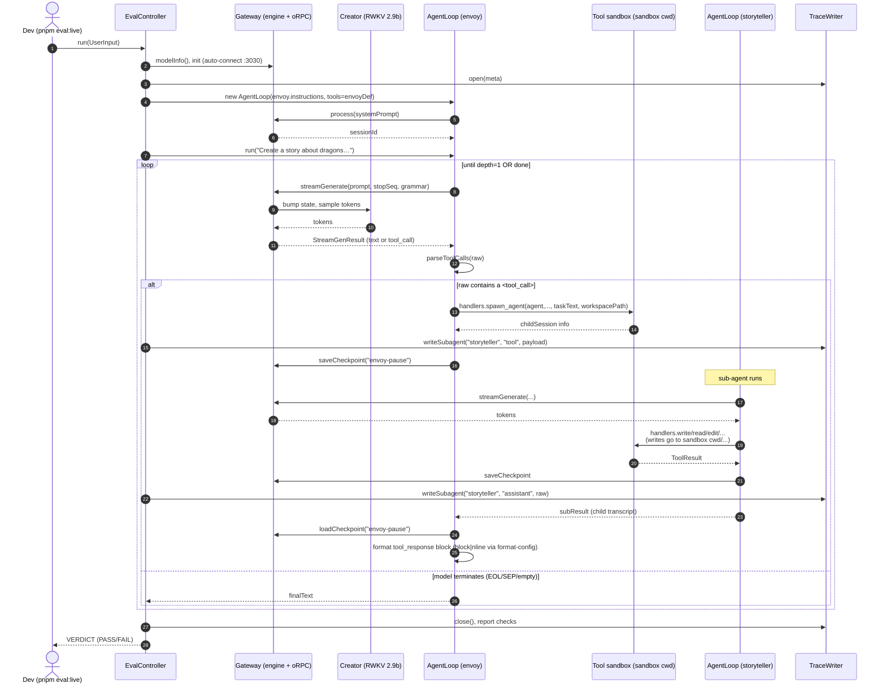

# Architecture

> **TL;DR** — `eval` -> `agent-lib (envoy/storyteller loop)` -> `oRPC over HTTP/WS` -> `gateway` -> `RWKV engine`. The gateway owns the model and the live RNN state. Every tool call is intercepted, executed against a sandbox, and its result is fed back into the prompt loop. Traces (block format) capture every turn + every tool call verbatim so they double as regression fixtures.

---

## 1. Boxes

```
┌──────────────────────────────────────────────────────────────────────┐
│                       INFERENCE SERVER (gateway)                      │
│  ┌──────────────────┐  ┌──────────────────┐  ┌──────────────────┐    │
│  │ Rust engine      │  │ Session host     │  │ Http/WS router   │    │
│  │ (web-rwkv, ~RWKV │→ │ (multi-session,  │→ │ (oRPC: REST + WS │    │
│  │  v7, 4 GB VRAM)  │  │  checkpoints,    │  │  + OpenAPI spec) │    │
│  │ + napi-rs        │  │  baseline state) │  │                  │    │
│  └──────────────────┘  └──────────────────┘  └──────────────────┘    │
└────────▲─────────────────────────▲────────────────────────────────────┘
         │                         │
   native binding           oRPC (typed client)
         │                         │
┌────────┴─────────────────────────┴──────────────────────────────────┐
│                      AGENT LIB / ENGINE                              │
│  src/agents/loop.ts  — prompt + parse + dispatch (loads AgentLoop)   │
│  src/agents/envoy    — delegation agent, spawns spawn_agent          │
│  src/agents/storyteller — file-writer agent, many write/edit tool    │
│  src/agents/{coder,…}    — etc                                       │
│  src/agents/format-config.ts — central config (SEP, STOP_SEQ, mode)  │
└────────▲─────────────────────────────────────────────────────────────┘
         │
   invokes tools via
   sandboxed handlers
         │
┌────────┴─────────────────────────────────────────────────────────────┐
│                            TOOL SANDBOX                               │
│  src/tools/{read,write,edit,ls,mkdir,grep,find}.ts                   │
│   - `write` auto-creates parent dirs, appends `.md` if no extension   │
│   - paths resolved relative to EVAL_SANDBOX (= temp folder for eval) │
└────────▲─────────────────────────────────────────────────────────────┘
         │ spawn_agent(task, workspace) -> mkdir → branch
┌────────┴─────────────────────────────────────────────────────────────┐
│                          EVAL SANDBOX                                 │
│  /tmp/eval-story-XXXXX/workspace/...                                  │
│  Per-run temp dir, chdir'd before hierarchy runs; cleanup after ok.   │
│  Source of truth for oracle assertions (files exist, content exact). │
└───────────────────────────────────────────────────────────────────────┘
```

## 2. Sequence (dolphin) diagram — end-to-end `pnpm eval:live`



## 3. Module map

| Layer | Path | Role |
|-------|------|------|
| Engine | `native/rwkv-bindings/` | Rust napi-rs binding to `web-rwkv 0.10`. Loads `.st` safetensors, runs RNN, exposes `inferStream` per-token |
| Engine JS | `src/model/native-rwkv-model.ts` | `Model` interface impl; state cache, baseline, checkpoint I/O |
| Gateway | `src/gateway/server.ts` | Express + WS, serves OpenAPIHandler at `/rpc` |
| oRPC | `src/rpc/{contract,server,client}.ts` | Single source of truth for client↔server procedures (typed via Zod) |
| Sessions | `src/session/{session,session-host}.ts` | Per-session JSONL log + state checkpoints; multi-session routing |
| Agent loop | `src/agents/loop.ts` | Prompt → generate → parse tool call → execute → feed; max depth, repeated-loop guard |
| Format config | `src/agents/format-config.ts` | One immutable `getFormatConfig()`: SEP, STOP_SEQ, tool-response placement (block/inline), subagent wrappper (xml/none), indent style |
| Templates | `src/agents/{example-template,examples}.ts` | Semantic example entries (`think` / `tool_call` / `tool_response`) with renderers (`default`, `no-think`) |
| Agents | `src/agents/{envoy,storyteller,coder}/` | Per-domain system prompts, tool subsets, examples |
| Tool sandbox | `src/tools/{read,write,edit,ls,mkdir,grep,find}.ts` + `src/tools/utils/` | Zod-driven tool impls; `write` auto-appends `.md` |
| Eval | `src/eval/{eval-controller,trace-writer,story-creation.eval,trace-writer.test}.ts` | Sandbox-per-run; mock oracle + live mode; streaming trace writer |
| Channels | `src/web/index.html`, `src/tui/index.ts`, `src/cli.ts` | Browser dashboard, terminal UI, direct CLI — all consume the same gateway oRPC client |

## 4. State and data flow rules

* **Gateway owns state.** Only the gateway holds the live RNN state. Anything that talks to it does so via oRPC `stream` for tokens and `loadBaseline`/`saveCheckpoint`/`loadCheckpoint` for state context.
* **Channels never talk to the engine directly.** They use `HttpModel(engineUrl)`, which proxies per-token events through `stream`. That keeps the model loaded one place.
* **Eval intercepts calls.** Eval doesn't bypass the gateway in live mode; in oracle mode it stubs the `Model` interface with a `MockModel` so no engine is loaded.
* **Sandbox is per-run.** Eval creates a fresh `mkdtemp` chdir'd as cwd before the agent hierarchy runs. Tool handlers (read/write/ls) resolve against `process.cwd()`. `write` autocreates parent dirs.
* **One config.** `getFormatConfig()` is read by the loop, trace writer, eval controller, and template renderers. Override via env (`SEP`, `STOP_SEQ`, `TOOL_RESPONSE_PLACEMENT`, `SUBAGENT_WRAP`, `INDENT_STYLE`) per-run without rebuild.
* **Trace is observable truth.** Every tool response is appended to the trace via `onToolResult`. A `<tool_call>` with no follow-up `tool_response` in the trace is now a regression test (see `trace-writer.test.ts → traceShapeAgentLoopTest`).

## 5. Failure modes and where they surface

| Badge | Where it surfaces |
|-------|-------------------|
| Empty generation | `loop.ts:run` writes `[agent-loop] WARN: empty generation at depth N` and breaks — visible as a non-empty trace line |
| Tool-call parse error | Captured in `errors[]` next to `toolCalls`; loop invocation fails the trace shape test |
| Repeated tool with same path | `loop.ts:isRepeatedLoop` injects a `tool_response` saying "try a different approach" |
| Grammar constraint violation | Engine-side bitmask rejection — never reaches the trace |
| Stale state | Re-running after abort can produce nonsense; eval checks catch this indirectly via state paths |

## 6. References

- `PLAN.md` — phase-by-phase roadmap
- `AGENTS.md` — file-layout cheat sheet + runbook
- `MOSE.md` — MoSE (state mixers) reference
- `TODO.md` — outstanding items (this doc evolves from there)
- `TODO_PLAN.md` — current plan + checklist
- `TODO_PROGRESS.md` — in-progress log
- `NEXT_STEPS.md` — forward-looking plan beyond `TODO.md`
